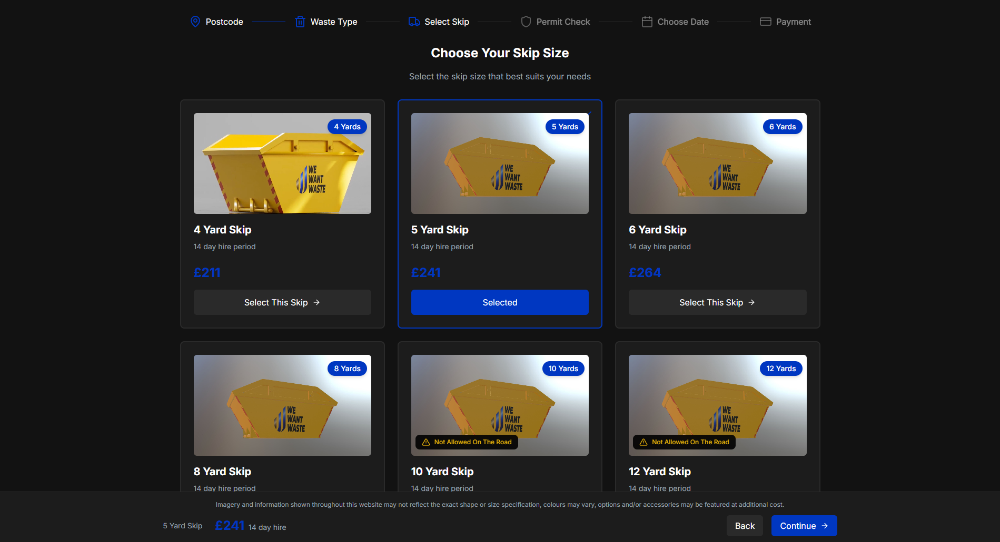
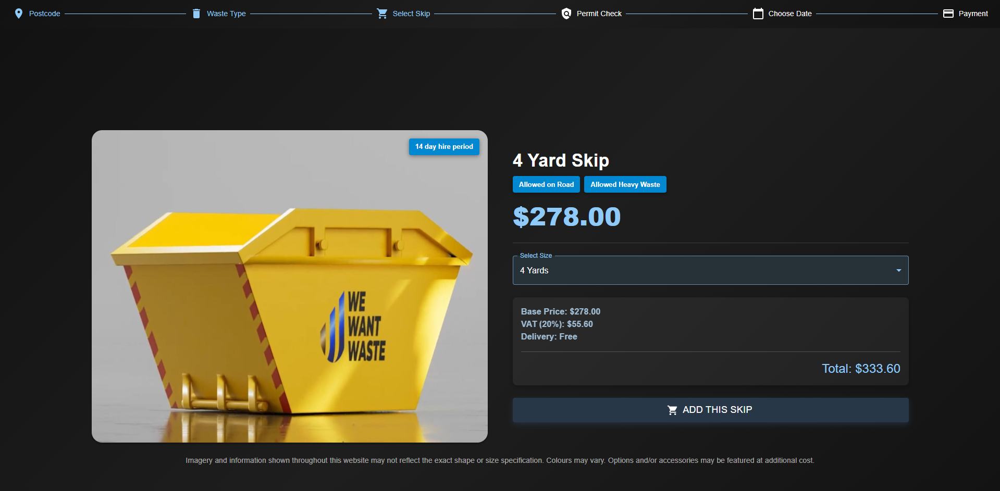

# We Want Waste – Yard Skip Selector Redesign - React + Vite Project

This project presents a redesigned version of the **Yard Skip Selection** page for **WeWantWaste**. The original layout used multiple individual cards for each skip size, each containing static details like size, price, and hire period. This new design improves usability, performance, and clarity by converting the layout into a modern, interactive single product page with dynamic content updates.

---

## 🚀 Redesign Overview

### ✅ Old Design (Before)
- Repeated information leading to clutter.
- Multiple static cards for each yard skip size.
- Poor scalability and user experience on mobile devices.
- Image, price, and details not dynamically linked to user selection.

### ✨ New Design (After)
- A **single-page product layout** with a unified interface.
- Introduced a **Select Size** dropdown to allow users to choose different skip sizes — one at a time.
- **Dynamic updates**: Selecting a size dynamically updates:
  - Yard skip **image**
  - **VAT (20%)**
  - **Base Price**
  - **Hire Period**
  - **Delivery fee**
  - **Total Price**
  - **On-road availability**
  - **Heavy waste allowance**
- 📦 **Add to Cart with Toastify**: Clicking the "Add to Cart" button triggers a toast notification.
- 🔄 **Loading Spinner**: A full-page loader appears centered while data is being fetched from the API.

---

## 🧠 Key Features

| Feature                     | Description |
|----------------------------|-------------|
| 🖼️ **Dynamic Image Preview**      | The image changes based on selected skip size. |
| 💷 **Price Breakdown**            | Includes base price, VAT (20%), delivery, and total price. |
| 🕐 **Hire Period Display**        | Clearly indicates how long the selected skip can be hired. |
| 🧾 **Dynamic Skip Size Selector** | Users can choose a size from a dropdown; all details update accordingly. |
| ✅ **Availability Indicators**    | Shows whether the selected skip is allowed on-road and if heavy waste is permitted. |
| 🔔 **Toast Notifications**        | Uses `react-toastify` to confirm when an item is added to the cart. |
| 🔃 **Centered Loader**            | Uses `SyncLoader` and flexbox to show a spinner centered on screen during loading state. |

---

## 📐 Design Goals & Improvements

- ✅ **Responsiveness**: Clean layout that works well across devices.
- ✅ **Simplified UI**: Removed clutter caused by displaying all skip cards at once.
- ✅ **Improved UX**: Easier decision-making by consolidating skip details into a single view.
- ✅ **Modern Aesthetic**: Aligns more with ecommerce-style product pages (e.g., Amazon, Junaid Jamshed) for familiarity.

---

## 🛠️ Tech Stack

- **React** – Frontend library
- **Vite** – Lightning-fast build tool and dev server
- **MUI (Material UI)** – UI components and layout
- **Axios** – HTTP client for API calls
- **React Toastify** – Toast notifications
- **React Spinners (SyncLoader)** – Fullscreen loading spinner

---

## 📸 Screenshots

### Before


### After


---

## 📁 Folder Structure

```plaintext
wewantwaste-redesign/
├── public/
│   └── index.html
├── src/
│   ├── assets/
│   │   └── yard-images/         # All skip yard images
│   ├── components/
│   │   ├── Herosec.jsx          # Main hero/selector component
│   │   └── SkipCard.jsx         # (Optional) legacy or reusable card component
│   ├── constants/
│   │   └── index.js             # Contains static data like yardImages array
│   ├── pages/
│   │   └── HomePage.jsx         # Main landing page with logic
│   ├── services/
│   │   └── api.js               # Axios API calls for yard skip data
│   ├── App.jsx                  # Main App component
│   ├── main.jsx                 # Entry point for React
│   └── index.css                # Global styles
├── .gitignore
├── package.json
├── vite.config.js
└── README.md
